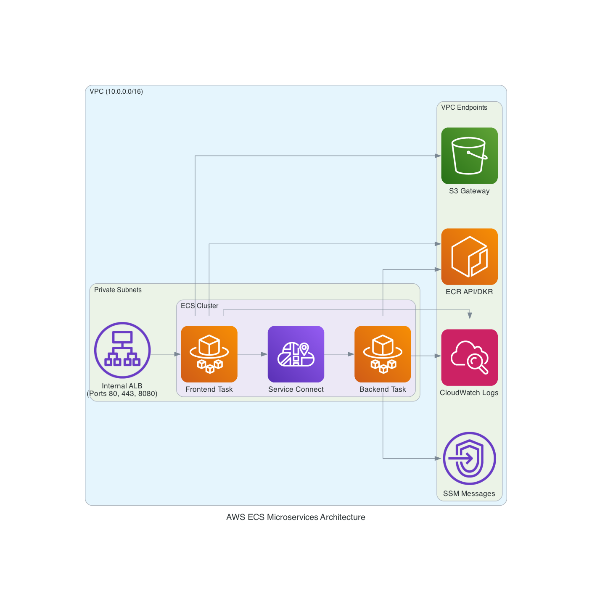

# Private Serverless Microservices on AWS ECS Fargate

This repository contains Terraform code to provision a fully private, serverless microservices architecture on AWS using ECS Fargate, Service Connect, and an Internal Application Load Balancer.

## Architecture Overview

The infrastructure is designed with a strong focus on security and internal-only networking. There are no public subnets, NAT Gateways, or Internet Gateways. All AWS service communication is routed securely via AWS PrivateLink (VPC Endpoints).

### Architecture Diagram



### Key Components

1. **Networking (VPC)**
   - 100% Private Subnets spread across Availability Zones.
   - **VPC Endpoints**: Because the subnets are fully private, Fargate requires endpoints to pull images (`ecr.api`, `ecr.dkr`, `s3`), stream logs (`logs`), and allow ECS Exec shell access (`ssmmessages`).

2. **ECS Fargate Cluster**
   - Two microservices: `frontend-service` and `backend-service`.
   - **Service Connect**: Replaces traditional Service Discovery by injecting an Envoy proxy sidecar. This allows the frontend to resolve and communicate with the backend using a simple local namespace (`http://backend-service:8080`).
   - **ECS Exec Enabled**: Systems Manager (SSM) integration allows for secure, interactive shell access directly into the containers without SSH or bastion hosts.

3. **Internal Application Load Balancer**
   - Attached to the `frontend-service` Target Group.
   - Listeners for `HTTP 80`, `HTTPS 443` (using a generated self-signed TLS certificate), and `HTTP 8080`.
   - Accessible only from within the VPC.

4. **Application Logic**
   - A lightweight Python HTTP server (`app/app.py`) built for `linux/amd64`.
   - Differentiates its behavior based on the `SERVICE_NAME` environment variable.
   - The frontend container uses the `UPSTREAM_URL` environment variable to fetch data from the backend.

## Deployment Instructions

1. **Initialize Terraform**
   ```bash
   terraform init
   ```

2. **Build and Push the Application Image**
   Before applying Terraform, the ECR repository needs the initial image.
   ```bash
   # Build for x86_64 architecture (required for Fargate defaults)
   docker build --platform linux/amd64 -t <AWS_ACCOUNT_ID>.dkr.ecr.ca-central-1.amazonaws.com/ecs-test-repo:latest app/
   
   # Authenticate with AWS ECR
   aws ecr get-login-password --region ca-central-1 | docker login --username AWS --password-stdin <AWS_ACCOUNT_ID>.dkr.ecr.ca-central-1.amazonaws.com
   
   # Push the image
   docker push <AWS_ACCOUNT_ID>.dkr.ecr.ca-central-1.amazonaws.com/ecs-test-repo:latest
   ```

3. **Deploy Infrastructure**
   ```bash
   AWS_PROFILE=original terraform apply
   ```

## Testing the Infrastructure

Because the ALB and tasks are entirely private, the easiest way to test the setup from your local machine is by using **ECS Exec** to drop into a shell inside one of the Fargate containers.

### Prerequisites: Session Manager Plugin

To use ECS Exec, you must install the AWS Session Manager Plugin on your local machine.

**macOS Installation:**
```bash
curl "https://s3.amazonaws.com/session-manager-downloads/plugin/latest/mac/sessionmanager-bundle.zip" -o "sessionmanager-bundle.zip"
unzip sessionmanager-bundle.zip
sudo ./sessionmanager-bundle/install -i /usr/local/sessionmanagerplugin -b /usr/local/bin/session-manager-plugin
```

**Linux Installation (Ubuntu/Debian):**
```bash
curl "https://s3.amazonaws.com/session-manager-downloads/plugin/latest/ubuntu_64bit/session-manager-plugin.deb" -o "session-manager-plugin.deb"
sudo dpkg -i session-manager-plugin.deb
```

For other OS versions, refer to the [official AWS documentation](https://docs.aws.amazon.com/systems-manager/latest/userguide/session-manager-working-with-install-plugin.html).

### 1. Start a Session
Retrieve your task ID from the AWS console or CLI, and run:
```bash
PATH="$HOME/.local/bin:$PATH" aws ecs execute-command \
    --cluster demo-cluster \
    --task <YOUR_TASK_ID> \
    --container frontend-container \
    --interactive \
    --command "/bin/sh" \
    --profile original \
    --region ca-central-1
```

**2. Test Service Connect (Backend)**
```bash
# Verify the frontend can talk to the backend via Service Connect DNS
curl http://backend-service:8080
```

**3. Test the Internal ALB**
First, retrieve the ALB DNS name:
```bash
aws elbv2 describe-load-balancers --names frontend-alb --query 'LoadBalancers[0].DNSName' --output text --profile original --region ca-central-1
```
Then, from inside your container shell:
```bash
# HTTP
curl http://<ALB_DNS_NAME>:80

# HTTPS (Use -k to ignore self-signed certificate warnings)
curl -k https://<ALB_DNS_NAME>:443
```
